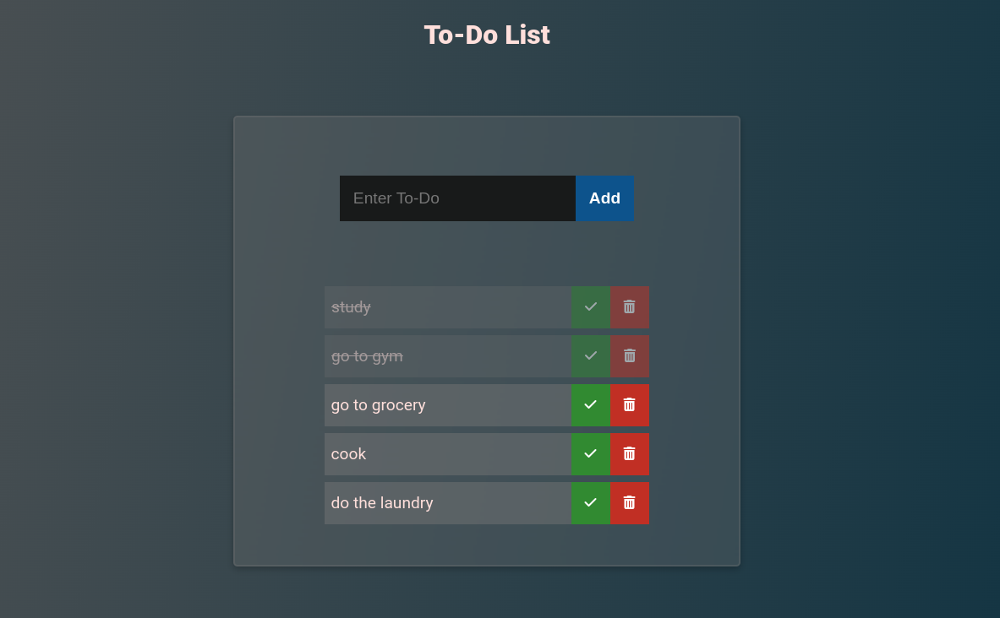

### Exercise at DCI - Web Development course

This is for educational purposes only. All credit for the design is given to the original designer.

:fast_forward: **[Live demo](https://akiko-luka.github.io/todo-list/)**

### Overview
Using Vanilla JavaScript, this mini project sets up a simple to-do list application in the browser. It includes functionality to add tasks, mark them as completed with a check button, and delete tasks with a trash can button.

### Tools used
- Vanilla JS
- HTML
- CSS
- Git
- Github
- VSCode

## Screenshot

